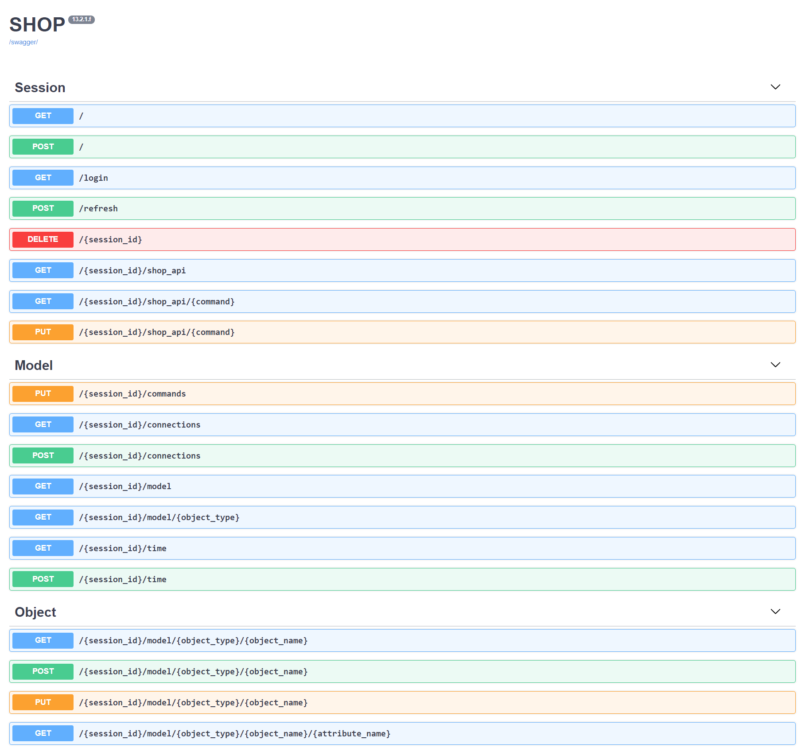

---
jupytext:
  text_representation:
    extension: .md
    format_name: myst
    format_version: 0.13
    jupytext_version: 1.13.8
kernelspec:
  display_name: Python 3
  language: python
  name: python3
---

(interaction)=
# Interacting with SHOP

+++

While the main functionality of SHOP lies in the SHOP core, several libraries are implemented for interacting with it. In this document the following ways of interaction are described.

```{contents}
:local:
```

Proprietary **ASCII** file formats used to be the only way for sending data to the SHOP core and getting results back. After introduction of the SHOP API, several open standards for interacting with the SHOP core have been added. Currently, the **pyshop** python wrapper has gained popularity among users, students and developers. The new **YAML** file format is included as an open standard alternative to the ASCII format. All functionality in SHOP is accessible by any of these three ways of interacting with the core. By accessing the SHOP core through the API, as is done in pyshop and for YAML, all data that is loaded into the SHOP core can also be retrieved and stored.

+++


+++

(proprietary-ascii-interaction)=
## Proprietary (ASCII) interaction

The proprietary interaction with SHOP is done by a set of **command**-files, **input data**-files and **output result**-files. The command files control which files are read into the SHOP core, which processing is done in the core, and which results files that are written from the SHOP core. Commands can also be entered directly in the built-in SHOP command interpreter. Input data files can include any of the [](ascii-data).

Commands are written in the format

command /(option1) /(option2) (object1) (object2)
    
Valid commands and related options and objects are found in the [](command-table).

ASCII files can be read directly by the SHOP core compiled as a standalone executable, or sent to the SHOP core via any of the APIs, either as a string or as a path to a file.

+++

(yaml-interaction)=
## YAML interaction

All input data, output data and commands are part of the same YAML structure. This structure is explained in the [](yaml-standard).
YAML files can be read and written directly by the SHOP core compiled as a standalone executable, or sent and retrieved via any of the APIs as strings.

+++

(pyshop-interaction)=
## pyshop interaction

Pyshop is a wrapper in python written on top of the SHOP python API. It makes interacting with the SHOP core more efficient by providing helpful classes and functions to exchange data and execute commands. The data handling in pyshop uses the python pandas package in most cases.

The typical workflow in pyshop starts by creating a ShopSession and defining the optimization time and resolution. Next, the topology is added before time-dependent data is generated or loaded from files or a database. When all data is sent to the SHOP core, commands for optimization are executed before results are extracted.

+++

(openapi-interaction)=
## OpenAPI interaction

The OpenAPI is a way of interacting with SHOP when it is hosted as a web service. The figure below shows the session-based structure. It is integrated with all API data by respective endpoints for **commands**, **connections**, **time**, **object_type**, **object_name** and **attribute**.

+++



+++

(cpp-api-interaction)=
## C++ API interaction

Not published yet.

+++

(python-api-interaction)=
## Python API interaction

Not published yet.
