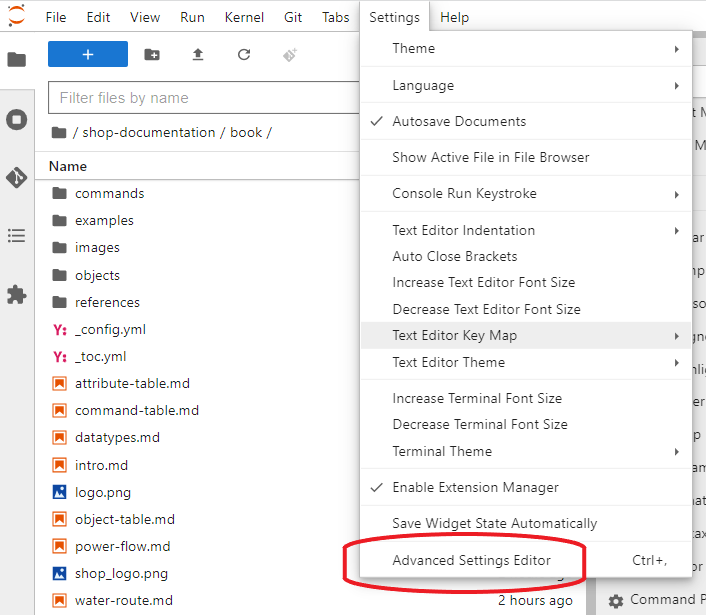
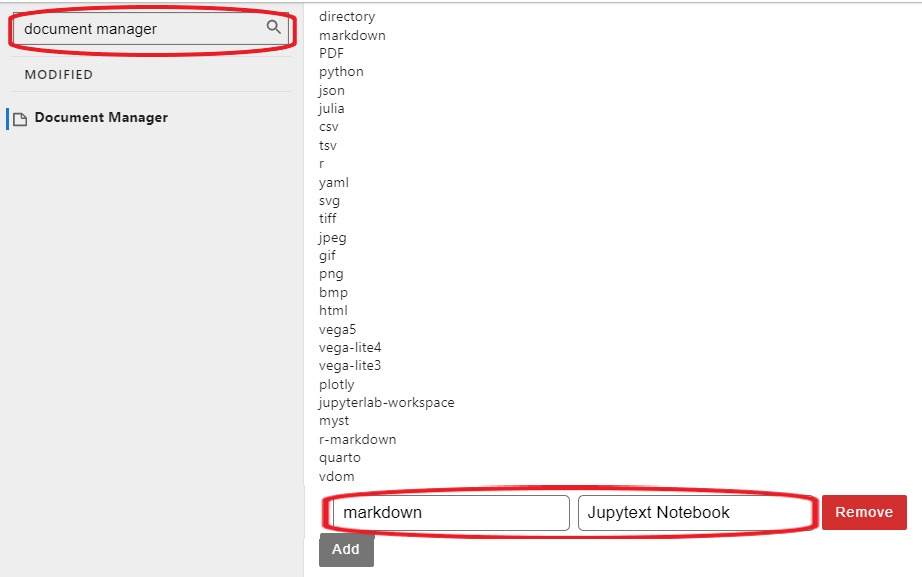

---
jupytext:
  text_representation:
    extension: .md
    format_name: myst
    format_version: 0.13
    jupytext_version: 1.13.8
kernelspec:
  display_name: Python 3 (ipykernel)
  language: python
  name: python3
---

# Getting started

This documentation presents an updated overview of available functionality in SHOP. Many of the functionalities are presented through examples. SHOP supports several input formats as decribed in the [introduction](interaction). For new SHOP users, the introduction example is recommended before looking into more advanced functionality. To get started coding your own models, you can either use the [vLab](https://vlab.sintef.energy) where pySHOP is preinstalled in a Jupyter based environment, or you can [download SHOP](https://shop.sintef.energy/files/shop-releases/) from the portal and install [pySHOP](https://github.com/sintef-energy/pyshop) on your local computer.

<div style="padding:56.25% 0 0 0;position:relative;"><iframe src="https://player.vimeo.com/video/738925679?h=b94fb52b25&amp;badge=0&amp;autopause=0&amp;player_id=0&amp;app_id=58479" frameborder="0" allow="autoplay; fullscreen; picture-in-picture" allowfullscreen style="position:absolute;top:0;left:0;width:100%;height:100%;" title="New SHOP documentation with vLab support!"></iframe></div><script src="https://player.vimeo.com/api/player.js"></script>

## Launching code with SHOP vlab
This documentation contains executable code examples that can be executed on the SHOP virtual lab simply by hovering  in the top right corner and select . This will redirect you to the virtual lab. The first time you use it, files with extensions .md will not render correctly. To render .md files as notebooks, select *Settings -> Advanced settings editor* as shown below.


Search for *Document Manager* in the search field and add the keyword-value pair *markdown* and *Jupytext Notebook* at the bottom at the page as shown below.


You can try it out here and now by clicking the  to execute the code below.

Happy coding!

```{code-cell} ipython3
:tags: ["remove-output"]
print("Hello SHOP!")
```


