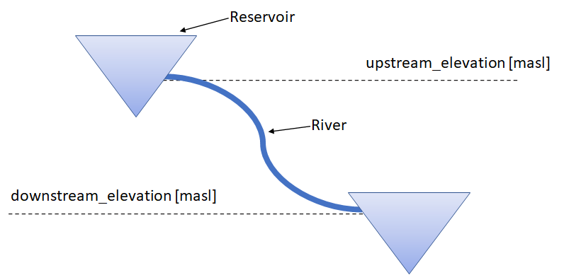
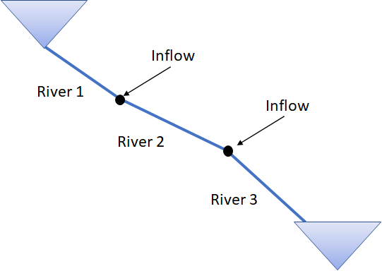
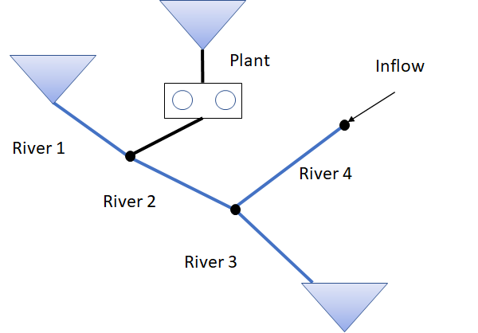
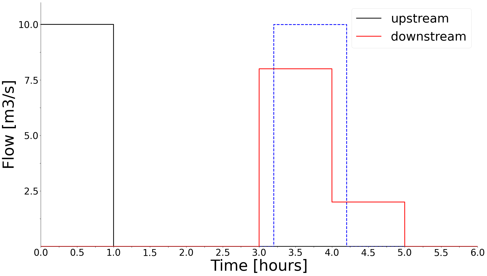
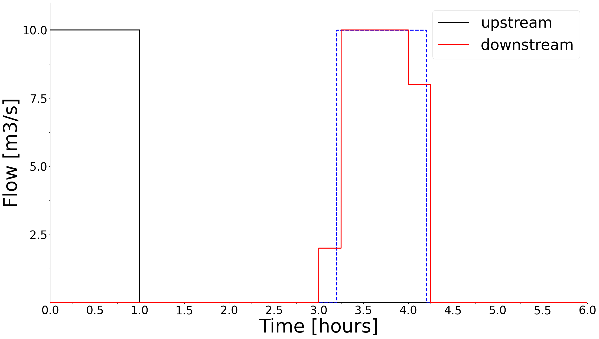
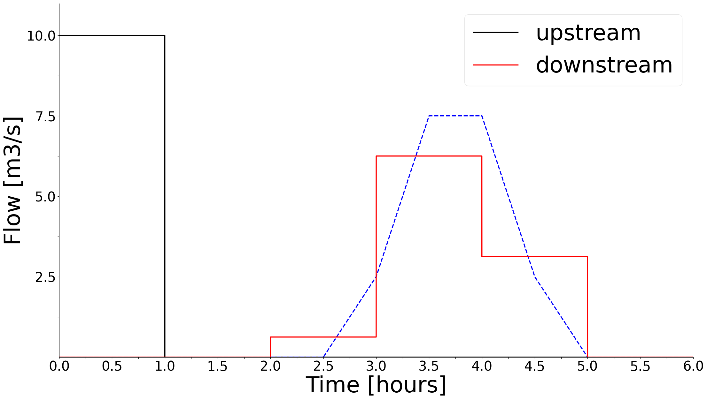
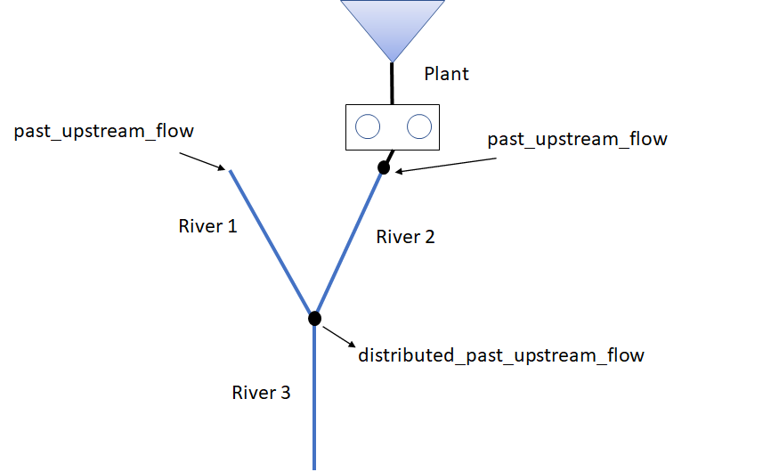
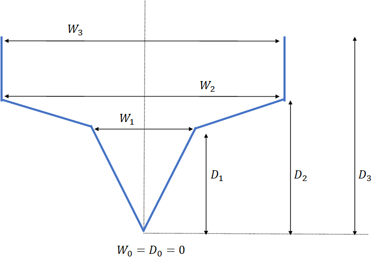

---
jupytext:
  text_representation:
    extension: .md
    format_name: myst
    format_version: 0.13
    jupytext_version: 1.13.8
kernelspec:
  display_name: 'Python 3'
  name: python3
---

(river)=
# river
The river object models open channel flow of water in a river streach or channel between reservoirs

|   |   |
|---|---|
|Input connections|<a href="reservoir.html">reservoir</a>, <a href="plant.html">plant</a>, <a href="discharge_group.html">discharge_group</a>, <a href="tunnel.html">tunnel</a>, <a href="river.html">river</a>|
|Output connections|<a href="river.html">river</a>, <a href="reservoir.html">reservoir</a>, <a href="discharge_group.html">discharge_group</a>|
|License|SHOP_OPEN|
|Release version|14.3.1.0|

```{contents}
:local:
:depth: 1
```

## Introduction

In its basic form, the river object simply moves water between two other objects in SHOP, such as between two reservoirs. However, it is designed to model two main situations well: long river stretches with complex time delay, and accurate flow functions in shorter channels and over weir crests. Time delay and flow functions have existed in SHOP before the river object, mainly on the gate object, but these formulations have been expanded and improved upon in the river implementation. In addition, the river object can be connected in new ways compared to the gate objects, which allows for a better physical representation of the system.

The basic river functionality is open to all users, which means it will be possible to convert an existing gate object to a river object without buying a new license. The SHOP_RIVER license unlocks all river functionality, which includes the possibility of connecting rivers in new ways and all river attributes that have no equivalent gate attribute. Please consult the interactive attribute documentation table further down in this document for the license requirements of specific attributes, but note that some special cases are mentioned explicitly in the description below.

## 1 Necessary input and basic behavior

The only required input for the river object is the double attribute [**upstream_elevation**](river:upstream_elevation) This attribute is not always used, but is required to ensure topological consistency. The attribute value is the upstream elevation of the river bottom in masl. A similar [**downstream_elevation**](river:downstream_elevation) attribute is also found on the river object, but it is currently not used. Figure 1.1 shows a basic river topology.

||
|---|
| <b>Figure 1.1: A simple river topology where the river connects two reservoirs. The dashed #lines mark the elevation of the upstream and downstream river heights.</b> |

If no other input is given for the river, SHOP can freely optimize the amount of water that flows in the river. The resulting optimized river flow is saved to the [**flow**](river:flow) output TXY attribute, which is identical to the [**upstream_flow**](river:upstream_flow) attribute. In the simple case shown in Figure 1.1, water from the upper reservoir can be transported instantaneously to the lower reservoir, even if the upstream reservoir elevation is below the upstream_elevation of the river. There are no maximum flow limitations imposed by default, and there is no explicit cost of water flowing in the river[^1]. It is possible to impose such restrictions with the [**min_flow**](river:min_flow), [**max_flow**](river:max_flow), and [**flow_cost**](river:flow_cost) TXY attributes, but they must be specified by the user for each river object. The [**flow_schedule**](river:flow_schedule) TXY attribute can be used to force the amount of water that must flow into the river, and the cost for breaking the schedule can be specified with the [**flow_schedule_penalty_cost**](river:flow_schedule_penalty_cost) TXY attribute. Ramping constraints on the upstream river flow in either direction can also be added with the [**ramping_up**](river:ramping_up) and [**ramping_down**](river:ramping_down) TXY attributes (requires either the SHOP_RIVER or GATE_RAMPING license).

It is possible to add natural inflow to the river object with the [**inflow**](river:inflow) TXY attribute. This is water that enters the top of the river at the height of upstream_elevation. Rivers can be connected to other river objects, which makes it possible to model inflow entering the river at different points by splitting up the river into segments. This can be useful when there is time delay in the river. Figure 1.2 shows an example of this type of topology.

||
|---|
| <b>Figure 1.2: The river between the upper and lower reservoir is split into three parts, where natural inflow from creeks enter at the top of River 2 and 3.</b> |

Rivers can have multiple input sources, but only a single output. A complete list of valid input and output objects is found at the beginning of this documentation page[^2]. Reservoirs, plants, and other rivers are the most usual river input objects. Figure 1.3 shows a modified version of Figure 2 with a power plant and another river as input to River 2 and River 3. Note that a river does not require any input object, like River 4 in Figure 1.3, but this means that the inflow will be the only water arriving downstream. This can still be useful if there is significant time delay in the river and inflow is measured somewhere upstream. The river object can also be left without any downstream connection, this means that the water flowing in the river is lost out of the system. If a single reservoir has multiple output rivers without any other output connections, the int attribute [**main_river**](river:main_river) can be set to 1 for the river that represents the main water way out of the reservoir. This attribute is only needed for energy conversion calculations, such as converting the energy_value_input of a reservoir to a water value. The first river connected to the reservoir will be used if none of the rivers have set the main_river attribute to 1.

||
|---|
| <b>Figure 1.3: A river system with different input objects at different locations.</b> |

[^1]: The difference in water value will usually impose an implicit cost of transporting water downstream.
[^2]: The river object can only be connected as a gate object if the user does not have the SHOP_RIVER functionality.

---

## 2. Modelling rivers with time delay

Long rivers may introduce a considerable delay in the time it takes for water to flow from the start to the end of the river. There are two different ways of modelling the time delay in river objects in SHOP: either a constant time delay or a predefined wave form can be specified. The examples shown are not based on any realistic data, and are exaggerated to show the model behavior in edge cases.

### 2.1 Constant time delay

A constant time delay is specified on the double attribute [**time_delay_const**](river:time_delay_const) on the river object. The time delay decides how long it takes the water flowing into the top of the river to reach the bottom of the river. Consider a SHOP optimization with hourly time resolution and a river with a constant time delay of 3.2 hours. Figure 2.1 shows how an upstream river flow of 10 m<sup>3</sup>/s will be distributed among the time intervals when it reaches the bottom of the river.

||
|---|
| <b>Figure 2.1: The black line is the flow in the top of the river in the first hourly time interval, while the red line shows the delayed downstream flow results from SHOP. The red line is an hourly discretization of the true downstream flow, shown as the blue dashed line.</b> |

Since the discharge must be constant within a time interval in a linear optimization model like SHOP, 10 m<sup>3</sup>/s will flow into the river from the beginning to the end of the first time interval (black line). Assuming no dispersion of the water as it travels downstream, 10 m<sup>3</sup>/s of water will flow out of the river from t = 3.2 h to t = 4.2 h (dashed blue line). This affects both the fourth and fifth hourly time intervals in SHOP, where 80% of the total upstream volume discharged in the first time interval arrives downstream in the fourth time interval. The resulting downstream flow reported by SHOP (red line) is saved to the attribute [**downstream_flow**](river:downstream_flow) output TXY on the river object. In the case shown in Figure 2.1, a constant 8 m<sup>3</sup>/s will flow out of the river between hour 3 and 4 and 2 m<sup>3</sup>/s will out flow between hour 4 and 5. This distortion of the actual downstream flow is due to the length of the time intervals compared to the fractional time delay, and can be viewed as a sampling frequency problem. Figure 2.2 shows the same situation where the time resolution is 15 minutes instead of 1 hour, which improves the situation. The issue will completely disappear if the time_delay_const is an integer number of time intervals.

||
|---|
| <b>Figure 2.2: The same as in Figure 2.1, but the time resolution is 15 min instead of 1 hour.</b> |

The underlying assumption for distributing the delayed water between time intervals is that the total volume entering and leaving the river must be preserved. This ensures that the mass balance of the hydropower system is conserved, and using varying time interval sizes within the optimization horizon can be easily handled.

### 2.2 Time delay with a wave shape curve

In the case of a constant time delay in the previous section, the water flowing down the river is assumed to not disperse before reaching the end of the river. A wave of water will naturally disperse based on a number of factors, such as the friction and shape of the river. It is possible to mimic the behavior in SHOP by specifying a wave shape curve in the form of the XY array attribute [**time_delay_curve**](river:time_delay_curve). The time_delay_curve is an array of XY functions where each XY can be given a reference flow in m<sup>3</sup>/s. This makes it possible to have a time delay which is dependent on the flow in the river. The x-vector must be identical for all of the XY tables in the time_delay_curve, and the resulting wave shape is the linear interpolation of the y-values of the two XY curves closest to the flow in the previous SHOP iteration.

The following example assumes that only a single XY curve is given in, which means that the same wave shape is applied independent of the flow in the river. The time_delay_curve is given in the table below:

|X (hours)|Y (volume fraction)|
|---|---|
|2.5|0.25|
|3.0|0.50|
|3.5|0.25|
|4.0|0.0|

Consider the upstream flow in a short time period of length $dt$. The curve above describes that 25% of the upstream volume discharged in the small time interval will end up downstream between 2.5 and 3 hours later. 50% of the volume arrives between 3 and 3.5 hours later, while the remaining 25% arrives between 3.5 and 4 hours later. The final point in the curve must have weight 0.0 to signify that all of the water has arrived downstream. The sum of the Y-values must sum to 1.0 to ensure that no water is created or lost during transit in the river, an automatic re-scaling will be performed by SHOP if this criteria is not met. Figure 2.3 visualizes how 1 hour of 10 m<sup>3</sup>/s upstream flow is transformed by the time_delay_curve in an optimization with 15 minute time steps.

||
|---|
| <b>Figure 2.3: The black line is the upstream flow in the river, while the red line shows the delayed and dispersed downstream flow results from SHOP when using a 15 min time resolution. The blue dashed line is the true continuous time delayed water wave.</b> |

The total downstream flow is found by summing up the contribution of all the vanishingly small time intervals of length dt within a time step in the optimization. The upstream flow at the very beginning of the optimization, say from $t = 0$ to $t = dt$, arrives downstream between $t = 2.5$ and $t = 4 + dt$. The total upstream discharge of 10 m<sup>3</sup>/s for 1 hour (four consecutive 15 min intervals) will therefore arrive between $t = 2.5$ and $t = 5$, so the length of the dispersed downstream wave will be the sum of the upstream wave duration and the width of the time_delay_curve. The dashed blue line in Figure 2.3 shows the true downstream wave in the limit where $dt$ goes to zero, resulting in a continuous curve which is the *convolution* of the upstream flow pulse and the time_delay_curve. The convolution of two rectangular box functions, such as the upstream flow pulse and one segment of the time_delay_curve, results in a trapezoid function. The total downstream flow will therefore be a sum of trapezoid functions, one for each segment in the time_delay_curve. The SHOP results (red line) is a discretization of the continuous convolution curve, which will depend on the time resolution used in SHOP. Figure 2.4 shows how the downstream SHOP results will be distorted when using a coarser time resolution of hourly time steps.

||
|---|
| <b>Figure 2.4: The black line is the upstream flow in the river, while the red line shows the delayed and dispersed downstream flow results from SHOP when using a hourly time resolution. The blue dashed line is the true continuous time delayed water wave.</b> |

The true continuous convolution curve in Figures 2.3 and 2.4 are identical, as it only depends on the length of the upstream wave and the time_delay_curve. This means that the resulting downstream flow optimized by SHOP will converge towards the blue dashed curve as the time resolution in the optimization is increased.

### 2.3 Historical upstream river flow

There will initially be no downstream flow coming out of the river in SHOP if there is a time delay larger than the size of the time intervals in SHOP. To remedy this, the upstream flow that occurred in the hours *before* optimization can be added to the river as the input XY-table [**past_upstream_flow**](river:past_upstream_flow). The water defined in the past_upstream_flow will be distributed to the downstream flow of the river according to the time delay defined on the river object (constant or wave shape curve). An example of a past_upstream_flow curve is shown in the table below:

|X (hours)|Y (flow)|
|---|---|
|-5|10|
|-3|8|
|-2|12|

Note that the X-values must be *negative* numbers specifying the number of hours before optimization start. The flow is assumed to be constant within the intervals defined by the past_upstream_flow curve, meaning that 10 m<sup>3</sup>/s flowed into the river from 5 to 3 hours before optimization start. The final value in the curve is assumed to last until the start of the current optimization period. Only delayed water that enters into the optimization horizon is considered.

If several river objects are coupled in series, the past_upstream_flow of the top rivers will automatically be transferred down the entire river chain considering the time delay in each river object (if any). The calculated past upstream flow for each river in the chain is saved to the output XY attribute [**distributed_past_upstream_flow**](river:distributed_past_upstream_flow). Figure 2.5 shows a river system where past_upstream_flow is defined for the two top river objects and distributed_past_upstream_flow is calculated for the downstream river object.

||
|---|
| <b>Figure 2.5: A system where two rivers merge into a single river. past_upstream_flow is defined for both River 1 and River 2, while distribute_past_upstream_flow is calculated for River 3 based on the time delay of the upstream rivers.</b> |

The resulting initial flow out of the bottom of each river is saved in the output TXY attribute [**initial_downstream_flow**](river:initial_downstream_flow) on river object. This is simply the (distributed_)past_upstream_flow of the river transported downstream according to the time delay in the river and ignoring any water that arrives outside the optimization period.

### 2.4 Value of delayed water at the end of the optimization

If there is time delay in a river, some of the water will likely be in transit by the end of the optimization period. This water will eventually end up in a downstream reservoir (or the sea), and it should be evaluated according to the downstream water value. If the water value of the downstream reservoir is constant, the same value is used for the delayed water in the upstream river. If the water value is defined in terms of a water value table, a constant water value is estimated based on the marginal water value given the start volume of the reservoir. This value is then used for the delayed water in the river. When cuts are used, the marginal water value is taken to be the cut coefficient of the the reservoir for the cut that is binding given the start volume of all reservoirs in the cut group.

The estimation of the marginal water value in the reservoir based on the start volume is not always a good approximation when cuts or water value tables are used. In cases where there is need for better control of the water value for river water in transit, the double attribute [**delayed_water_energy_value**](river:delayed_water_energy_value) can be specified for the river. The unit of delayed_water_energy_value is €/MWh, and it is converted to €/Mm<sup>3</sup> internally in SHOP. The conversion factor in MWh/Mm<sup>3</sup> is based on the best-point of operation of the best plant below the downstream reservoir. It is the same conversion factor used when converting output water values to €/MWh, and is saved to the double attribute [**energy_conversion_factor**](reservoir:energy_conversion_factor) on the [reservoir object](reservoir).

---

## 3 River flow according to reservoir levels

Instead of allowing SHOP to freely optimize the flow in the river, it is possible to specify different types of flow functions for the river object. The different flow functions determine the flow in the river based on the reservoir level in the upper (and sometimes lower) reservoir. The flow functions described below are therefore only used if the river object is connected directly to the upstream reservoir.

### 3.1 Flow based on the upstream reservoir level

#### 3.1.1 Flow based on a flow table

The most direct way to define a river flow based on the upstream reservoir water level is to define the XY array attribute [**up_head_flow_curve**](river:up_head_flow_curve) on the river object. The up_head_flow_curve describes the flow out of the reservoir (y-values in m<sup>3</sup>/s) as the reservoir head changes (x-values in masl). Note that this attribute is an array of XY tables, where the reference values are the gate positions for each table (see Section 3.1.3 for gates). If there is no gate, a single XY table like the table below can be supplied:

|X (masl)|Y (flow)|
|---|---|
|120.0|0|
|120.5|10|
|121.0|100|

Note that the first x value should correspond to the upstream_elevation of the river, and this should result in zero flow. The flow into the river in time step t will be decided by the average reservoir head over the time interval, calculated as the average of the head at the start and end of the time interval. The reservoir head in the SHOP optimization is based on a linearization of the reservoir vol_head curve and the volume variable. The river flow will in turn be a linearization of the up_head_flow_curve around the reservoir head values from the previous SHOP iteration. Since the linearization is not always 100% accurate, the output TXY attribute [**physical_flow**](river:physical_flow) saves the post-calculated flow based on the final reservoir head values.

The up_head_flow_curve will only be used if the river object is directly connected to a reservoir upstream, otherwise it is ignored.

If the reservoir level is below the upstream_elevation of the river, the flow will be zero. This means that the flow in the river follows a non-convex behaviour, and the use of binary variables are needed to ensure that the flow is zero below the upstream_elevation threshold. Activating binary variables for the river flow can be done by setting the [**mip_flag**](river:mip_flag) TXY attribute to 1. It is recommended to activate the mip_flag for a river if considerable deviations are observed. If the mip_flag is not active, a linear set of constraints will still be added to dissuade the optimization from letting water flow in the river for reservoir levels below the upstream_elevation. Note that it is never necessary to use binary variables if the upstream_elevation of the river corresponds with the LRL of the reservoir.

A river with an up_head_flow_curve can act as a spill gate if the river's upstream_elevation is the same as the reservoir HRL. The flow_descr attribute on the reservoir can then be removed and instead added as an up_head_flow_curve on the river.

#### 3.1.2 Flow based on weir geometry

Instead of supplying a flow table for the river, it is possible to let the flow out of the upstream reservoir be determined by the geometry of the river opening. The XY attribute [**width_depth_curve**](river:width_depth_curve) must be defined to use this functionality, which describes the cross section of the river opening. The following width_depth_curve:

|X (m)|Y (m)|
|---|---|
|0|0|
|W<sub>1</sub>|D<sub>1</sub>|
|W<sub>2</sub>|D<sub>2</sub>|
|W<sub>3</sub>|D<sub>3</sub>|

is visualized in Figure 3.1.

||
|---|
| <b>Figure 3.1: A cross section of a river channel described by piecewise linear segments and symmetry around the center.</b> |

The x values represent the width of the opening at the depth specified in the y values. Note that the first y value must be zero, while the first x value can be non-zero (flat bottom). Note that the depth values are measured relative to the upstream_elevation attribute, where a depth of 1 meter in the river opening is 1 meter above the upstream_elevation (masl).

The resulting flow out of the reservoir and into the river is calculated based on the assumption of critical steady state flow. Critical flow occurs when the specific energy is minimum for a given discharge[^3]. Examples of critical flow is water passing over a broad-crested weir, which is the underlying assumption in the SHOP implementation. The flow is given as:

$$q = \sqrt{g\cdot\frac{A(h)^3}{W(h)}},$$

where $g$ is the acceleration of gravity, $h$ is the river depth (reservoir level above the upstream_elevation level), $A(h)$ is the wetted area of the river opening, and $W(h)$ is the width of the river opening at the water surface. The water level is determined by the upstream reservoir level. If the width_depth_curve is a box function of constant width, $A = W\cdot h$, the flow will be proportional to $h^{3/2}$. For more complicated width_depth_curves, such as the one in Figure 3.1, the flow will be a piece-wise non-linear function of the reservoir head. In SHOP, the flow equation is linearized in a similar way to the up_head_flow_curve. The flow is linearized around the physical flow given the average reservoir head for the time step in the previous iteration. The physical_flow attribute is also calculated for rivers with this type of flow description, where the non-linear flow function is used directly.

The comments regarding the mip_flag attribute in Section 3.1.1 are also valid for rivers with flow according to the width_depth_curve.

[^3]: "Engineering Fluid Mechanics", 11th edition, Wiley, chapter 15.5

#### 3.1.3 Gates on river objects

When the flow in the river is decided based on either the up_head_flow_curve from Section 3.1.1 or the width_depth_curve and critical flow description in Section 3.1.2, it is possible to model a movable gate that can change the flow in the river. To add a gate to the top of the river, the XY attribute [**gate_opening_curve**](river:gate_opening_curve) must be defined. This curve converts between a gate "setting" (x value, number between 0 and 1) and the corresponding gate height (y value, meters):

|X |Y (meter)|
|---|---|
|0.0|0|
|0.5|10|
|1.0|12|

The gate_opening_curve above shows that the gate is 0 meters above the upstream_elevation of the river for gate setting 0.0. The height of the gate increases from 0 to 10 meters above upstream_elevation as the gate setting is increased to 0.5. For the maximal gate setting of 1.0, the gate is 12 meters above upstream_elevation. Note that the gate is assumed to be extended from the bottom and upwards, and is therefore *not* retracted from the bottom and upwards. Gates that are retracted from the bottom and upwards should be modelled as tunnel objects in SHOP. The gate height can be optimized freely in SHOP unless the TXY attribute [**gate_opening_schedule**](river:gate_opening_schedule) is defined. The gate_opening_schedule is a schedule for the gate setting (x value) in the gate_opening_curve. If the gate is to be optimized freely, an adjustment cost can be added by specifying the [**gate_adjustment_cost**](river:gate_adjustment_cost) TXY attribute. The gate_adjustment_cost is a cost for changing the gate position from one time step to the next. Ramping constraints for the gate can also be added with the [**gate_ramping**](river:gate_ramping) TXY attribute, and the [**gate_ramping_penalty_cost**](river:gate_ramping_penalty_cost) TXY can be used to adjust the cost for breaking the ramping constraints. The double attribute [**initial_gate_opening**](river:initial_gate_opening) can be used to define the gate setting at the beginning of the optimization period when either gate_adjustment_cost or gate_ramping is present on a river. It is recommended to use a gate_adjustment_cost and/or gate ramping constraints when the gate can be optimized, this generally helps to stabilize the optimzation results from iteration to iteration. The [**gate_height**](river:gate_height) output TXY attribute holds the resulting gate height in masl after optimization.

The up_head_flow_curve is an XY array attribute, where the reference of each XY table is the gate position. If a width_depth_curve is used to describe the river flow, the equation in Section 3.1.2 is modified to

$$q = \sqrt{g\cdot\frac{\Big(A(h)-A_g(h_g)\Big)^3}{W(h)}},$$

where $h_g$ is the height of the gate above the upstream_elevation and $A_g(h_g)$ is the wetted area that is covered by the gate. If $h_g > h$, the flow will be set to zero. If SHOP can optimize the gate position, the gate height variables will be incorporated into the linearization of the flow out of the reservoir.

### 3.2 Flow based on upstream and downstream reservoir levels

The flow in a river object is usually one-directional: from the upstream object to the downstream object. However, rivers can also be used to model channels connecting two reservoirs where the flow can be in either direction. The river must be directly connected to a reservoir upstream and another reservoir downstream to activate this behaviour. In addition, one of the attributes XY array attributes [**delta_head_ref_up_flow_curve**](river:delta_head_ref_up_flow_curve) and [**delta_head_ref_down_flow_curve**](river:delta_head_ref_down_flow_curve) must be specified for the river. Each XY table in the delta_head_ref_up_flow_curve attribute is referred to a specific upstream reservoir level, while the downstream reservoir level is used as references for the delta_head_ref_down_flow_curve. The x values represent the level difference, upstream level - downstream level, while the y values give the resulting flow. The flow can be both positive and negative, where positive flow is from the reservoir connected upstream towards the reservoir connected downstream. The point (0,0) should be present in all of the XY tables to enforce that the flow is zero when there is no difference in reservoir level. The following XY table (referred to some upstream reservoir level in masl) can be one of the XYs in the delta_head_ref_up_flow_curve:

|X (meter) |Y (flow)|
|---|---|
|-3.0|-100|
|-2.0|-10|
|0.0|0|
|2.0|10|
|3.0|100|

The table is not required to be symmetric (with a sign change) as in the example above.


## Attributes
```{code-cell} ipython3
:tags: ['remove-input', 'full-width']

import itables as itables
from itables import init_notebook_mode
init_notebook_mode(all_interactive=True, connected=True)
import pandas as pd
from IPython.core.display import HTML

table = pd.read_csv('https://shop.sintef.energy/wp-content/uploads/sites/1/2021/11/attributes_v14.csv')
object_attributes = table[table["Object type"] == "river"].reset_index().iloc[:, 1:]
for index, row in object_attributes.iterrows():
  object_attributes.at[index, "Attribute name"] = f"""<a href="{row['Object type']}.html#{row['Attribute name'].replace('_', '-')}">{row['Attribute name']}</a>"""
  object_attributes.at[index, "Data type"] = f"""<a href="../datatypes.html#{row['Data type'].replace('_', '-')}">{row['Data type']}</a>"""
itables.show(object_attributes,
  dom='tlip',
  search={'regex': True, "caseInsensitive": True},
  column_filters='header',
  columns=[
    {
      'name': '',
      'className': 'dt-control',
      'orderable': False,
      'data': None,
      'defaultContent': '',
    },
    {
      'name': 'Attribute name',
      'className': 'dt-body-left'
    },
    {
      'name': 'Data type',
      'className': 'dt-body-left'
    },
    {
      'name': 'I/O',
      'className': 'dt-body-left'
    },
    {
      'name': 'License',
      'className': 'dt-body-left'
    },
    {
      'name': 'Version added',
      'className': 'dt-body-left'
    },
    {
      'name': 'Description',
      'visible': False
    }
  ]
)
HTML('''<script>
$('tbody').on('click', 'td.dt-control', function () {
    var tr = $(this).closest('tr');
    var table = $(this).closest('table').DataTable();
    var row = table.row(tr);

    if (row.child.isShown()) {
        // This row is already open - close it
        row.child.hide();
        tr.removeClass('shown');
    } else {
        // Open this row
        row.child("<div align='left'>".concat(row.data()[6], "</div>")).show();
        tr.addClass('shown');
    }
});
</script>''')
```

(river:length)=
### length
Length of the river segment (xUnit: METER, yUnit: METER)


(river:upstream_elevation)=
### upstream_elevation
The elevation of the river floor upstream (xUnit: METER, yUnit: METER)


(river:downstream_elevation)=
### downstream_elevation
The elevation of the river floor downstream (xUnit: METER, yUnit: METER)


(river:time_delay_const)=
### time_delay_const
The time delay of the water flowing down the river (xUnit: HOUR, yUnit: HOUR)


(river:delayed_water_energy_value)=
### delayed_water_energy_value
Specifies a constant energy value used to evaluate the water in transit at the end of the optimization horizon. The water value of the downstream reservoir will be used if this attribute is not specified. (xUnit: NOK/MWH, yUnit: NOK/MWH)


(river:initial_gate_opening)=
### initial_gate_opening
Specifies the initial opening position of the gate in the river before optimization, which is used when applying gate_adjustment_cost and gate_ramping constraints for the first time step. These constraints will not be applied for t=0 if the initial gate opening is not specified (-1)  (xUnit: NO_UNIT, yUnit: NO_UNIT)


(river:main_river)=
### main_river
Specifies that this river should be considered the main waterway downstream a reservoir, and is only needed if a reservoir has no directly connected downstream power plant and has multiple output rivers. The first connected river is assumed to be the main river if this value has not been set on any of the output rivers. (xUnit: NO_UNIT, yUnit: NO_UNIT)


(river:width_depth_curve)=
### width_depth_curve
The curve describing the shape of the river cross section (xUnit: METER, yUnit: METER)


(river:flow_cost_curve)=
### flow_cost_curve
Describes a piece-wise constant cost curve for the flow in each time step for the river. This convex curve is preferred over the standard flow_cost TXY attribute if both are defined for the river object (xUnit: M3/S, yUnit: NOK/M3/S)


(river:peak_flow_cost_curve)=
### peak_flow_cost_curve
Describes the piece-wise constant cost curve for the highest achieved flow rate in the river over the optimization horizon (xUnit: M3/S, yUnit: NOK/M3/S)


(river:time_delay_curve)=
### time_delay_curve
Function for modelling wave-shaped time delay. X-values are the time since discharge and Y-values are the amount of water arriving at the end of the river at that time. Separate curves can be given in for different reference flows, in this case the time delay will be interpolated between the curves based on the flow in the past SHOP iteration. (xUnit: HOUR, yUnit: M3/S)


(river:past_upstream_flow)=
### past_upstream_flow
Represents the upstream flow in the river before the start of the optimization period, which is considered for rivers with time delay. The X-values represent the number of hours before optimization start, and should be increasing negative numbers. The Y-values are the corresponding flow. (xUnit: HOUR, yUnit: M3/S)


(river:up_head_flow_curve)=
### up_head_flow_curve
Function determining the relationship between water level in the reservoir directly above the river and the flow in the river. The XY flow functions can be given in for multiple gate settings where the gate opening position is the reference value of the XY table (xUnit: METER, yUnit: M3/S)


(river:gate_opening_curve)=
### gate_opening_curve
Function determining the relationship between the user-defined position of the gate (X-value) and the corresponding height in meters above the river bottom (Y-value) (xUnit: NO_UNIT, yUnit: METER)


(river:delta_head_ref_up_flow_curve)=
### delta_head_ref_up_flow_curve
Set of functions determining the relationship between the difference in water level between the reservoir directly above and below the river (X-value) and the flow in the river (Y-value). The reference for each function is the water level in the upper reservoir. (xUnit: METER, yUnit: M3/S)


(river:delta_head_ref_down_flow_curve)=
### delta_head_ref_down_flow_curve
Set of functions determining the relationship between the difference in water level between the reservoir directly above and below the river (X-value) and the flow in the river (Y-value). The reference for each function is the water level in the lower reservoir. (xUnit: METER, yUnit: M3/S)


(river:inflow)=
### inflow
The upstream natural inflow to the river (xUnit: M3/S, yUnit: M3/S)


(river:min_flow)=
### min_flow
Defines a minimum flow constraint for the river (xUnit: M3/S, yUnit: M3/S)


(river:max_flow)=
### max_flow
Defines a maximum flow constraint for the river (xUnit: M3/S, yUnit: M3/S)


(river:min_flow_penalty_cost)=
### min_flow_penalty_cost
The penalty cost for breaking the min_flow constraint. Overrides the default river_flow_penalty_cost defined on global_settings. (xUnit: NOK/M3/S, yUnit: NOK/M3/S)


(river:max_flow_penalty_cost)=
### max_flow_penalty_cost
The penalty cost for breaking the max_flow constraint. Overrides the default river_flow_penalty_cost defined on global_settings. (xUnit: NOK/M3/S, yUnit: NOK/M3/S)


(river:ramping_up)=
### ramping_up
Defines a maximum upward flow ramping constraint for the river (xUnit: M3SEC_HOUR, yUnit: M3SEC_HOUR)


(river:ramping_down)=
### ramping_down
Defines a maximum downward flow ramping constraint for the river (xUnit: M3SEC_HOUR, yUnit: M3SEC_HOUR)


(river:ramping_up_penalty_cost)=
### ramping_up_penalty_cost
The penalty cost for breaking the ramping_up constraint. Overrides the default gate_ramp_penalty_cost defined on global_settings. (xUnit: NOK/M3/S, yUnit: NOK/M3/S)


(river:ramping_down_penalty_cost)=
### ramping_down_penalty_cost
The penalty cost for breaking the ramping_down constraint. Overrides the default gate_ramp_penalty_cost defined on global_settings. (xUnit: NOK/M3/S, yUnit: NOK/M3/S)


(river:cost_curve_scaling)=
### cost_curve_scaling
The values in this time series will be multiplied with the flow_cost_curve values. This makes it possible to vary the convex flow_cost_curve over the optimization horizon. (xUnit: NOK/M3/S, yUnit: NOK/M3/S)


(river:flow_schedule)=
### flow_schedule
Schedule for flow through the river. If the river has time delay, it is referenced to the start of the river. (xUnit: NO_UNIT, yUnit: M3/S)


(river:flow_schedule_penalty_cost)=
### flow_schedule_penalty_cost
Penalty cost for breaking the flow_schedule for the river. The default penalty cost for all rivers can be set with the river_flow_schedule_penalty_cost attribute on global_settings (xUnit: NO_UNIT, yUnit: NOK/M3/S)


(river:gate_opening_schedule)=
### gate_opening_schedule
Schedule for opening of the gate in the river. The value given here is interpreted as the X-value of the gate_opening_curve. (xUnit: NO_UNIT, yUnit: NO_UNIT)


(river:flow_block_merge_tolerance)=
### flow_block_merge_tolerance
Maximum difference in flow between two timesteps that results in a merged result for these timesteps in the next iteration. This requires merging to be activated in the command file by set merge /on. (xUnit: NO_UNIT, yUnit: M3/S)


(river:gate_ramping)=
### gate_ramping
Maximal allowed change in the gate height per hour in both upward and downward direction. (xUnit: NO_UNIT, yUnit: METER/HOUR)


(river:gate_ramping_penalty_cost)=
### gate_ramping_penalty_cost
The penalty cost for breaking the gate ramping constraints in either upward or downward direction. (xUnit: NO_UNIT, yUnit: NOK/METER_HOUR)


(river:gate_adjustment_cost)=
### gate_adjustment_cost
The cost for changeing the gate height between two time steps in either upward or downward direction. (xUnit: NO_UNIT, yUnit: NOK/METER)


(river:flow_cost)=
### flow_cost
A linear cost for the flow of water in the river. If a covex flow_cost_curve is defined on the gate, it will be preferred over the flow_cost (xUnit: NO_UNIT, yUnit: NOK/M3/S)


(river:mip_flag)=
### mip_flag
A flag series used to turn on (1) and off (0) the use of binary variables to ensure that the river flow is zero when the reservoir head is below the gate or bottom of the river bed. Non-physical flow may occur if the mip_flag is turned off (xUnit: NO_UNIT, yUnit: NO_UNIT)


(river:flow)=
### flow
The flow in the river, referenced at the upstream enpoint (xUnit: M3/S, yUnit: M3/S)


(river:upstream_flow)=
### upstream_flow
The flow in the river at the upstream enpoint (xUnit: M3/S, yUnit: M3/S)


(river:downstream_flow)=
### downstream_flow
The flow in the river at the downstream enpoint (xUnit: M3/S, yUnit: M3/S)


(river:gate_height)=
### gate_height
The height of the gate in MASL (xUnit: METER, yUnit: METER)


(river:min_flow_penalty)=
### min_flow_penalty
The incurred penalty for breaking the min_flow constraint (xUnit: NOK, yUnit: NOK)


(river:max_flow_penalty)=
### max_flow_penalty
The incurred penalty for breaking the max_flow constraint (xUnit: NOK, yUnit: NOK)


(river:ramping_up_penalty)=
### ramping_up_penalty
The incurred penalty for breaking the ramping_up constraint (xUnit: NOK, yUnit: NOK)


(river:ramping_down_penalty)=
### ramping_down_penalty
The incurred penalty for breaking the ramping_down constraint (xUnit: NOK, yUnit: NOK)


(river:flow_penalty)=
### flow_penalty
The penalty incurred based on the flow_cost_curve and the flow rate in the river over the optimization horizon (xUnit: NO_UNIT, yUnit: NOK)


(river:peak_flow_penalty)=
### peak_flow_penalty
The penalty incurred based on the peak_flow_cost_curve and the highest achieved flow rate in the river over the optimization horizon (xUnit: NO_UNIT, yUnit: NOK)


(river:gate_ramping_penalty)=
### gate_ramping_penalty
The penalty incurred for breaking the gate_ramping constraints according to the gate_ramping_penalty_cost (xUnit: NO_UNIT, yUnit: NOK)


(river:gate_adjustment_penalty)=
### gate_adjustment_penalty
The incurred cost for changeing the gate height between time steps according to the gate_adjustment_cost (xUnit: NO_UNIT, yUnit: NOK)


(river:flow_schedule_penalty)=
### flow_schedule_penalty
The incurred cost for breaking the flow_schedule constraints on the river (xUnit: NO_UNIT, yUnit: NOK)


(river:physical_flow)=
### physical_flow
The physical flow into the top of the river based on the post-calculated reservoir head values. If the river flow is not dependent on the upstream reservoir head, the physical_flow will be identical to the regular flow attribute. (xUnit: NO_UNIT, yUnit: M3/S)


(river:initial_downstream_flow)=
### initial_downstream_flow
The calculated initial flow that will flow out from the end of the river. This is calulated based on the time delay in the river and the past_upstream_flow and distributed_past_upstream_flow attribute. (xUnit: NO_UNIT, yUnit: M3/S)


(river:distributed_past_upstream_flow)=
### distributed_past_upstream_flow
The past upstream flow of upstream river objects that have been distributed down to this river. (xUnit: HOUR, yUnit: M3/S)


